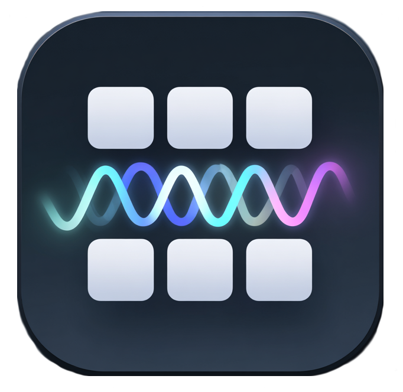

> Built for the <picture><source media="(prefers-color-scheme: dark)" srcset="apps/bytebeat_client/src/assets/CF Logo 2.jpg"></picture> × <picture><source media="(prefers-color-scheme: dark)" srcset="apps/bytebeat_client/src/assets/elevenlabs-logo-white.png"></picture> Hackathon — the challenge was to build something creative using [Cloudflare's developer platform](https://developers.cloudflare.com/workers/) and [ElevenLabs](https://elevenlabs.io/conversational-ai).

---

</br>

# ByteBeat

**Browser-based AI DJ studio — describe a sound, hear it instantly.**

Talk to your AI DJ, generate custom sounds on the fly, and build beats directly in the browser. No DAW. No samples pack. Just describe what you want and drop it on a pad.

---

## How It Works

1. Open ByteBeat — a 16-pad controller loads in your browser with your saved session
2. Click **Enable Voice** to connect to your AI DJ via ElevenLabs Conversational AI
3. Ask for a sound — *"give me a fat 808 kick on pad 1"*
4. The DJ calls `generate_sound`, ElevenLabs SFX generates the audio, it lands on the pad and plays automatically
5. Keep building — the DJ suggests patterns, BPM, and complements your existing sounds

---

## Sponsor Integrations

### ElevenLabs
- **Conversational AI** — full-duplex voice agent that listens, responds, and takes action. The DJ holds context across the session, adapts its greeting for returning users, and calls client-side tools in real time
- **Sound Effect Generation** — every pad sound is AI-generated from a text prompt via the ElevenLabs SFX API. Generated audio is returned as raw bytes, stored in R2, and served back instantly
- **Client tools** — the agent calls `generate_sound(prompt, name, slot_number)` directly from the conversation, auto-assigning the result to the correct pad without any UI interaction

### Cloudflare
- **Workers** — edge API handles sound generation, audio serving, session persistence, and AI agent routing
- **Durable Objects** — each session gets its own DO instance for consistent, low-latency state (pad assignments, BPM)
- **R2** — stores every generated MP3 with a 1-year cache header; sounds are shared across all sessions
- **KV** — caches sound metadata and generation results (24-hour TTL) to avoid re-generating identical prompts
- **Workers AI** — powers the text-based agent fallback (`@cf/meta/llama-3.1-8b-instruct`) for when voice is off
- **Vectorize** — wired up for semantic sound search (find similar sounds by description)

---

## Features

- 16-pad controller with reactive neon glow — pads light up based on their assigned sound color
- Voice-first AI DJ via ElevenLabs Conversational AI — talks, listens, and generates sounds mid-conversation
- Text-to-sound generation — describe any sound in plain English and get an MP3 in ~2 seconds
- Auto-assign to pad slot — the agent places sounds directly on numbered pads via tool call
- Community sound library — all generated sounds are shared and reusable across sessions
- Persistent sessions — pad layout and BPM saved to Cloudflare Durable Objects, restored on refresh
- Pad selection mode — click "use on pad" in chat and pads wobble to let you pick a slot visually
- MIDI-ready — each pad maps to a GM drum MIDI note (36–51)

---

## Tech Stack

| Layer | Tech |
|---|---|
| Frontend | React 19 + TypeScript + Vite |
| UI | Tailwind CSS v4 + Framer Motion |
| Audio | Tone.js |
| State | Zustand |
| Voice Agent | ElevenLabs Conversational AI |
| Sound Generation | ElevenLabs Sound Effect API |
| API | Hono on Cloudflare Workers |
| Session State | Cloudflare Durable Objects |
| Audio Storage | Cloudflare R2 |
| Metadata Cache | Cloudflare KV |
| AI Inference | Cloudflare Workers AI (Llama 3.1 8B) |

---

## Getting Started

**Prerequisites:** [Bun](https://bun.sh), a [Cloudflare account](https://dash.cloudflare.com), an [ElevenLabs account](https://elevenlabs.io)

```bash
git clone https://github.com/your-username/byteBeat.git
cd byteBeat
bun install
```

**API service** (`services/bytebeat_api/`):

1. Set `ELEVENLABS_API_KEY` in your Cloudflare Worker secrets (`wrangler secret put ELEVENLABS_API_KEY`)
2. Create the R2 bucket and KV namespace: `wrangler r2 bucket create bytebeat-audio` and `wrangler kv namespace create AUDIO_CACHE`
3. `bun run dev` — starts the Worker locally via Wrangler

**Frontend** (`apps/bytebeat_client/`):

1. Copy `.env` and set `VITE_API_URL` and `VITE_ELEVENLABS_AGENT_ID`
2. Create an ElevenLabs Conversational AI agent and add the `generate_sound` client tool (params: `prompt`, `name`, `slot_number`)
3. `bun run dev` — starts the Vite dev server

---

## License

MIT
